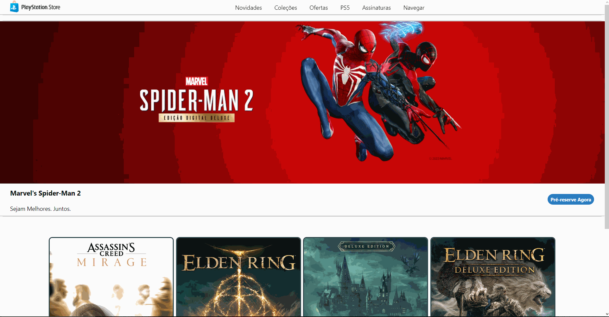

<h1 align="center"> Projeto PlayStation Store com Angular </h1>

Este é um projeto que foi desenvolvido como parte do Santander Bootcamp 2023 - Fullstack Java+Angular. O objetivo deste projeto foi de recriar a homepage da PlayStation Store aplicando conceitos de componentização de componentes. Modifiquei o projeto original para ficar mais parecido com a atual página da PlayStation Store.

 

    
    
Visualização do projeto no navegador

 

Visite a página <a href="#">aqui</a> ou siga as instruções abaixo para rodar localmente:

<h4>Instalando o projeto:</h4>

1- Clonando o repositório: `git clone https://github.com/viquiiz/angular-playstation-store.git`

2- Instalando o Angular: `npm install -g @angular/cli`

3- Instalando dependências: `npm install`

<h4>Rodando o projeto:</h4>

1- `ng serve`

2- Acessar no navegador: `http://localhost:4200`